# E-commerce Application using Java Spring, React.js, and MySQL

## Project Overview

The project concerns an e-commerce application, developed using Java Spring (server-side) and the React.js JavaScript library (client-side). The application interacts with a database using object-relational mapping (Spring Data combined with a MySQL database).

## Project Functionality Outline

The project supports an authorisation mechanism using JWT tokens and enables user registration and login (Spring Security). Appropriate security measures were implemented to ensure that only logged-in users have the required access. Additionally, two user types were introduced: an administrator with additional permissions and a standard user without these privileges. Consequently, some functionalities are restricted to specific user roles in the system. Passwords are hashed, and form validation is applied on both the server and client sides. The application's functionalities adhere to the CRUD principles:

- Create:
	- Registering users,
	- Adding products to the cart,
	- Adding new products,
	- Creating orders.
- Read:
	- Displaying all products,
	- Displaying the number of products in the cart,
	- Displaying detailed information about products,
	- Displaying user data,
	- Displaying order data,
	- Displaying products in the cart,
	- Searching for products (by name).
- Update:
	- Editing product data.
- Delete:
	- Deleting products,
	- Deleting users,
	- Removing products from the cart.

## Database Schema

Below is the database schema for the designed system:  
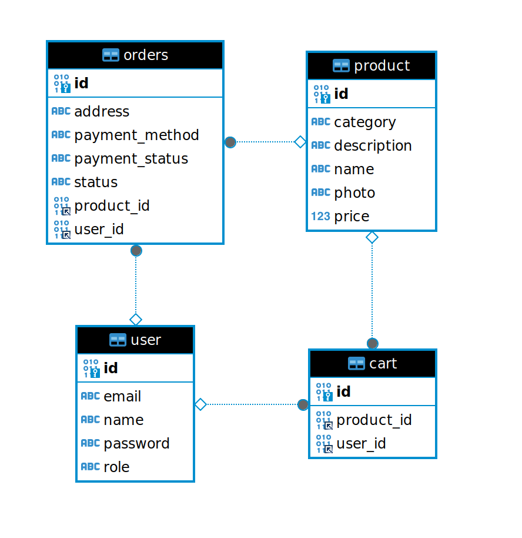  
   *Figure 1: Database schema for the designed system*  

The schema includes the following tables:
- `user` – stores user data,
- `product` – stores product data,
- `cart` – stores data about products currently in the cart,
- `orders` – stores data about placed orders.

## Screenshots
Screenshots of the running application are shown below:

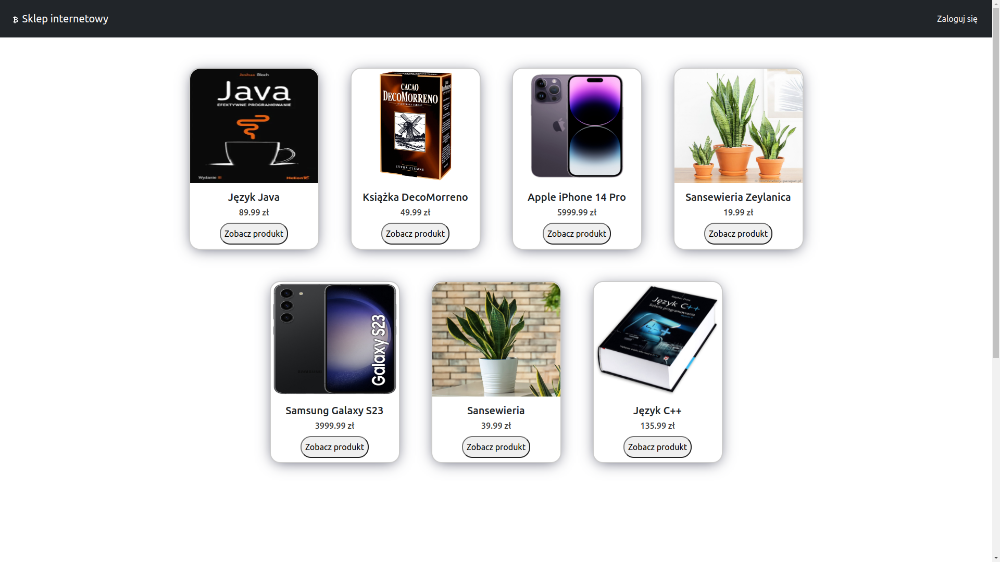  
   *Figure 2: Homepage of the application (view for unauthenticated users)*  

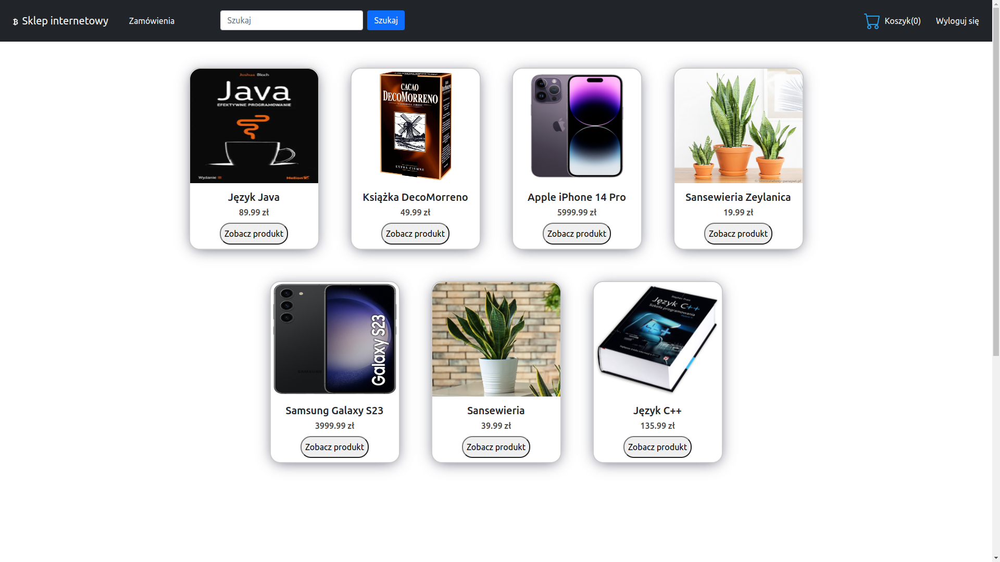  
   *Figure 3: Homepage of the application (view for authenticated users)*  

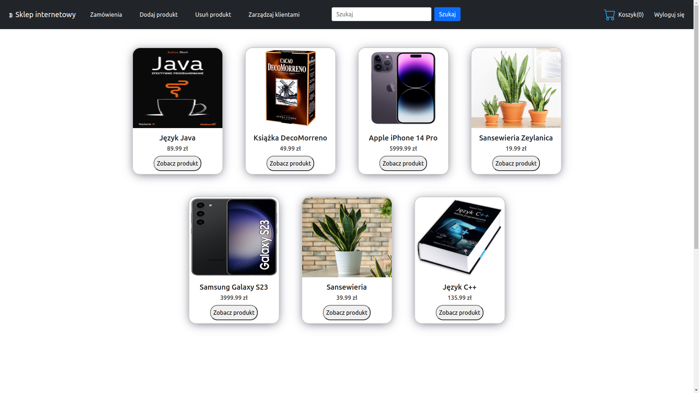  
   *Figure 4: Homepage of the application (view for administrators)*  

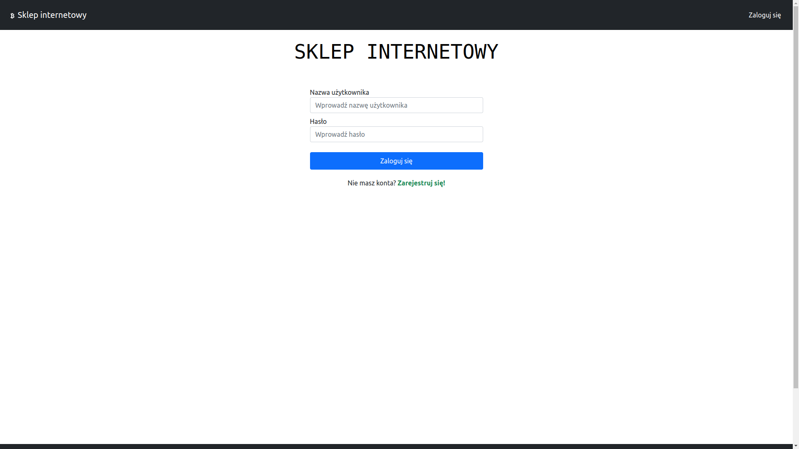  
   *Figure 5: User login view*  

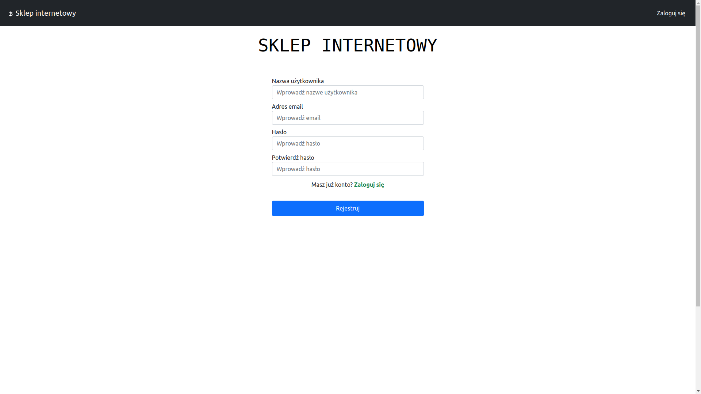  
   *Figure 6: User registration view*  

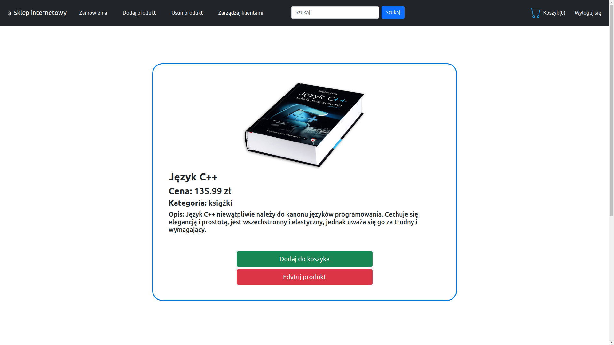  
   *Figure 7: Product details view (view for authenticated users)*  

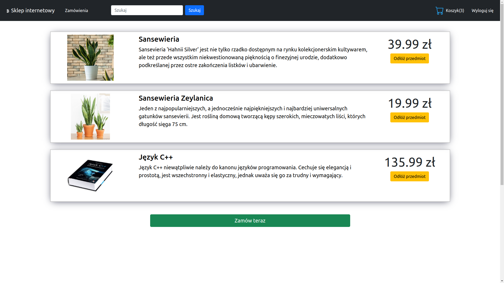  
   *Figure 8: Cart view with products (view for authenticated users)*  

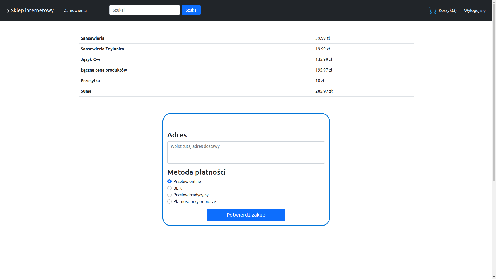  
   *Figure 9: Order and delivery processing view (view for authenticated users)*  

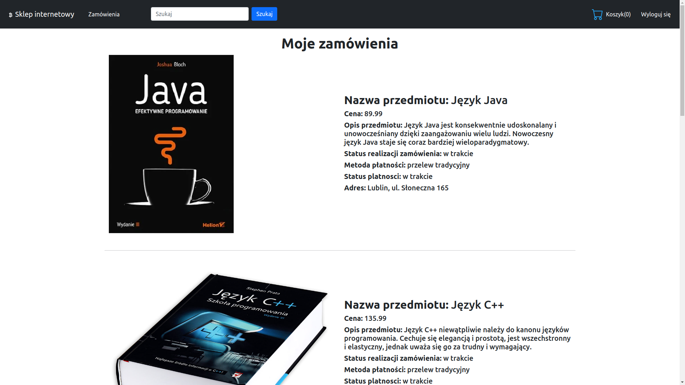  
   *Figure 10: Placed orders view (view for authenticated users)*  

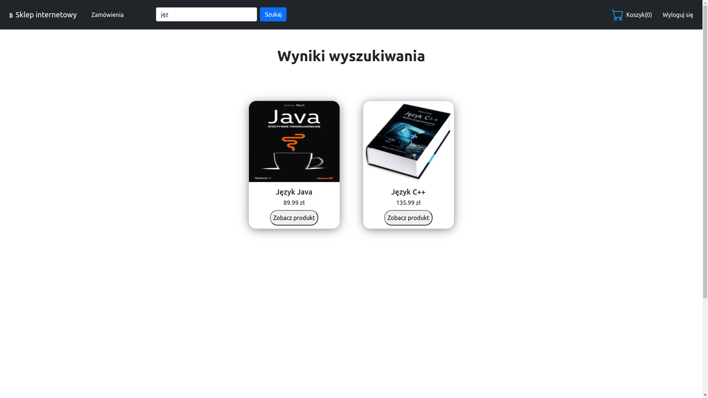  
   *Figure 11: Search results view (view for authenticated users)*  

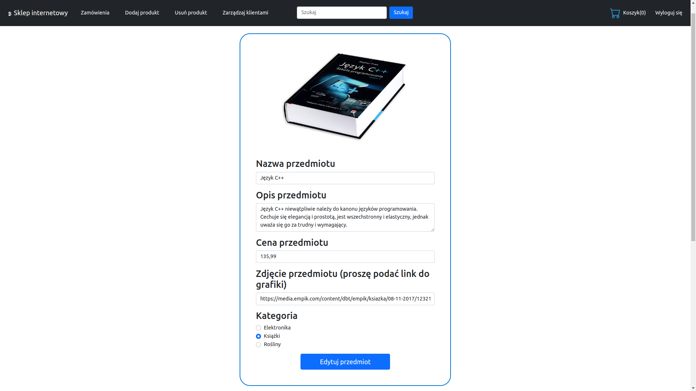  
   *Figure 12: Product data editing view (view for administrators)*  

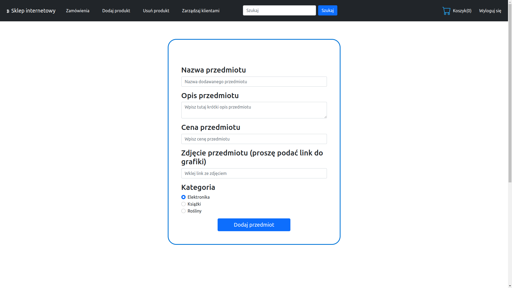  
   *Figure 13: New product addition view (view for administrators)*  

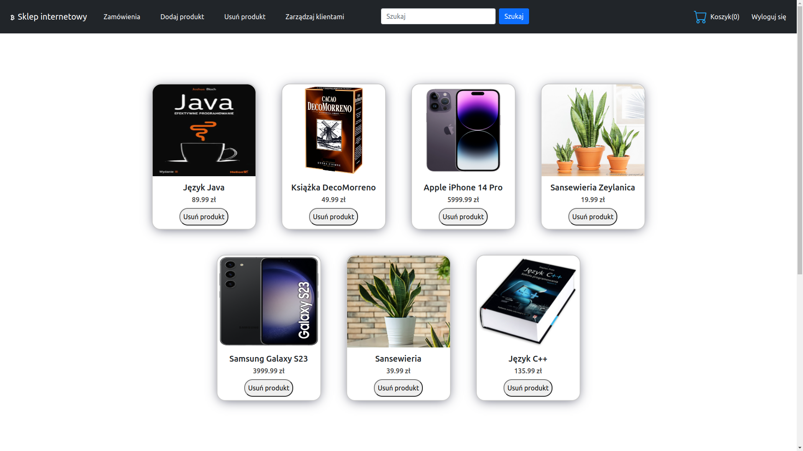  
   *Figure 14: Product deletion view (view for administrators)*  

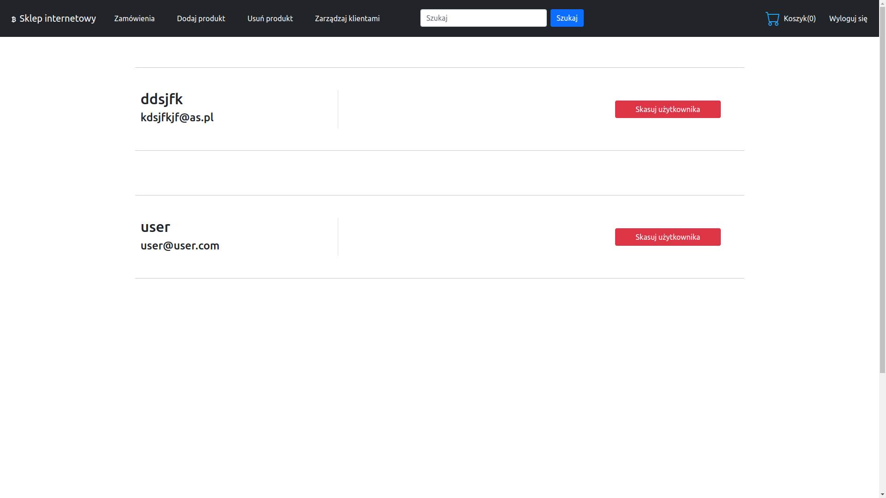  
   *Figure 15: Client management view (view for administrators)*  